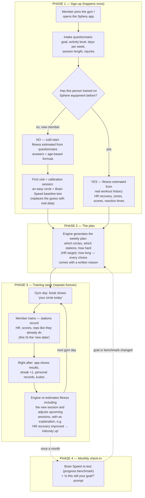

# Circle-Training Concept Brief — Meeting Prep (July 14)

**Context:** Yesterday's meeting established that prescribed plans should be
**circle trainings adapted to each gym's Sphere concept**, piloted on The
Sphere Darmstadt. This doc: (1) validates the goal taxonomy against market
research, (2) drafts the goal → stimulus → station mapping for Darmstadt,
(3) proposes the user journey, (4) summarizes what the top 10 comparable apps
do and what we should emulate, (5) answers the trainer-interface question,
(6) lists open decisions for today's session.

---

## 1. Goal taxonomy — validated, with edits

Market data (Statista health-club survey; 2025–26 gym member surveys): the top
member goals are **build muscle/strength (~34%)**, **lose weight (~33%)**,
**improve appearance (~32%)**, with a strong 2026 shift toward strength +
longevity ("get stronger" now beats "lose weight" as #1 priority in recent
surveys). Stress relief (~28%) and "it's fun" (~31%) rank surprisingly high —
which is exactly Sphery's gamified-fitness lane.

EGYM — the closest business analog (smart gym circuit, kiosk-driven, adaptive)
— ships exactly **8 fixed goal programs**: Immunity Boost, General Fitness,
Weight Loss, Body Toning, Muscle Building, Athletic, Rehab Fit, Metabolic Fit.
Fixed programs, not free-form goals. That's the pattern to copy.

### Recommended v1 goal list (edits from yesterday's list)

| # | Goal | Edit vs. yesterday | Primary stimuli |
|---|------|--------------------|-----------------|
| 1 | Lose weight / burn fat | **Merge into one** — identical prescription (energy expenditure: intervals + endurance + some strength) | cardio_intensity, cardio_endurance, strength |
| 2 | Build muscle & strength | keep | strength |
| 3 | Improve overall fitness | keep (the "default" goal) | balanced mix |
| 4 | Body & brain health | Rename of "physical, cognitive, mental health" — **Sphery's unique differentiator**, no competitor offers it | cognitive_motor, cardio_endurance |
| 5 | Healthy back / counter sitting | keep — huge desk-worker market | strength (posterior chain), mobility |
| 6 | Peak performance | keep ("extract maximum performance") | cardio_intensity, power, cognitive_motor |
| 7 | Event preparation | keep — at Darmstadt this concretely = **HYROX prep** (full original setup on site) | event-specific periodized mix |
| 8 | Rehab / therapy | keep. Reported injuries drive station exclusions rather than a hold on the plan (RehaFlow + medical leg press exist for this) | recovery, mobility |
| — | Create your own | **Cut as free text for v1.** A rules engine can't act on free text. Replace with "pick a primary + secondary goal" → engine blends stimulus weights. Free-form goal = v2 (LLM-assisted intake). | weighted blend |

**Why merging/cutting matters:** every goal must resolve to a deterministic
stimulus-weight vector the rules engine can act on. 8 goals × fixed weights is
demoable by Aug 14; free text is not.

---

## 2. Goal → stimulus → Darmstadt station mapping (draft for review)

**Data-model impact (flag in meeting):** current `StimulusType` vocabulary is
`cardio_endurance · cardio_intensity · cognitive_motor · recovery` (built for
ExerCube-only). Whole-gym circle training requires adding **`strength`**,
**`mobility_stability`**, and probably **`power_speed`**. This is a small,
planned-for extension — the plan model was designed equipment-agnostic.

### Station → stimulus capability matrix (The Sphere Darmstadt)

| Station | strength | cardio_end | cardio_int | cognitive_motor | mobility/stability | recovery | Data we already have |
|---|---|---|---|---|---|---|---|
| ExerCube — Racer (DualFlow, UpperBody, LegDay, RehaFlow…) | · | ✓ | ✓ | ✓✓ | · | ✓ (RehaFlow) | 20,945 workouts, HR + scores |
| ExerCube — SpeedCage (Season, Intervals, Boss modes…) | · | · | ✓ | ✓✓ | · | · | 6,345 games, reaction times |
| XR Fighter | · | ✓ | ✓ | ✓✓ | · | · | CircleTraining logs only |
| ICAROS Guardian | · | · | · | ✓ | ✓✓ | ✓ | CircleTraining logs only |
| Runner (sprint machine) | · | · | ✓✓ | · | · | · | CircleTraining logs only |
| Ski-Erg / Row-Erg | · | ✓✓ | ✓ | · | · | ✓ (low intensity) | CircleTraining logs only |
| Performance Bikes | · | ✓✓ | ✓ | · | · | ✓✓ | — |
| Free weights / power rack | ✓✓ | · | · | · | · | · | — |
| Medical leg press | ✓✓ | · | · | · | · | ✓ (rehab) | — |
| Cable pulls | ✓✓ | · | · | · | ✓ | · | — |
| HYROX: sled push/pull, wall balls, sandbag lunges, farmers carry, burpee broad jump | ✓ | ✓ | ✓✓ | · | · | · | CircleTraining logs only |
| Tidal Tanks | ✓ | ✓ | · | · | ✓ | · | — |

(✓✓ = primary stimulus, ✓ = secondary. This is my draft — **the expert review
Max/Stephan promised for the ExerCube mode→stimulus table should extend to
this matrix.**)

### How a plan then works
1. Goal → stimulus-weight vector (e.g. *Healthy back* = 50% strength-posterior,
   30% mobility, 20% cardio_endurance).
2. Fitness estimate → volume/intensity budget (sessions/week, HR targets, difficulty).
3. **Gym concept (= the registry of that gym's stations + their stimulus matrix)
   → concrete circle composition.** Same goal at a different Sphere gym with
   different stations → different but equivalent circle. This is the
   "adapted to each gym's concept" requirement, and it falls out of the
   equipment-profile design for free.

---

## 3. User journey / customer flow (proposal to whiteboard today)

Key beats borrowed from the best apps: **first-session achievement** (users
who earn an achievement on day one retain at ~33% vs ~20% without — a 64%
retention lift), **explanation with every change** (Future/JuggernautAI
pattern; already an acceptance criterion), **monthly benchmark ritual**
(EGYM BioAge re-measurement pattern → our Brain Speed assessment slots in
perfectly).

### Journey in five moments

1. **Onboarding (~2 min, app/kiosk):** questionnaire below. Existing members
   get dob/weight/height **prefilled from HealthData** (~99% filled) — confirm,
   don't retype. Branch: cold start (questionnaire-only estimate, Tanaka prior,
   conservative plan) vs. existing history (ML estimate drives the plan;
   questionnaire only adds goal + availability, which the data can't know).
2. **First session = calibration ritual:** moderate "get to know you" circle +
   Brain Speed assessment. Collapses cold-start uncertainty AND lands the
   day-one achievement ("Baseline set", streak day 1). Design it to be
   completable, not impressive.
3. **Weekly loop:** plan shows sessions with stimulus, stations, HR zone,
   duration, and a plain-language *why*. Training day: kiosk shows "your
   circle today"; stations record what they already record. Post-session:
   summary, streak +1, PRs, kudos, optional one-tap RPE.
4. **Adaptation:** new data → re-estimate → plan adjusts **with explanation**
   ("HR recovery improved 3 sessions in a row → intervals move to zone 4").
   Engine never schedules two cardio_intensity circles back-to-back
   (stimulus-recovery awareness, the Fitbod lesson).
5. **Monthly rituals:** Brain Speed re-assessment (the Brain-Age trend =
   our EGYM-BioAge moment) + goal re-check prompt ("Still training for HYROX
   in October?").

## 3b. Intake questionnaire spec (v1 draft)

Design rule: **every question must feed the fitness estimate or constrain the
plan** — otherwise cut it. Target: ≤10 questions, ≤2 minutes. No HR questions
ever (engine estimates resting/max HR from data; self-reports are garbage).
No free text (rules engine can't act on it).

**A — Profile** (prefilled from HealthData where present)
1. Date of birth *(required)* → age → Tanaka prior, zone calc
2. Weight / height *(required)* → BMI context, loads
3. Gender *(optional, "prefer not to say")* → minor model input only (~28% DB fill)

**B — Goal**
4. Primary goal *(single select, the 8 goals)* → stimulus-weight vector
5. Secondary goal *(optional, default none)* → ~70/30 weight blend — replaces free-text "create your own"
   - *If event prep:* which event + date → periodization end date
   - *If rehab/therapy:* prefer the medical/rehab corner and exclude contraindicated stations

**C — Background & availability**
6. "In a typical week, how often are you active 30+ min?" *(Rarely / 1–2× / 3–4× / 5×+)* → cold-start fitness prior (concrete, unlike "rate your fitness 1–10")
7. Strength-training experience *(Never / Some / Regular)* → intensity cap + progression speed on strength stations
8. "How many days/week can you **realistically** train?" *(1–7)* → volume budget
9. Preferred session length *(20/30/45/60 min)* → circle duration constraint

**D — Safety (PAR-Q-lite)**
10. Checkboxes: chest pain during activity · dizziness/fainting · doctor advised against exercise → any check surfaces a **see-your-doctor notice**, and the plan stays conservative
11. Injuries/problem areas *(back/knee/shoulder/hip/none)* → **hard station exclusions** (e.g. knee → no sled push/burpee broad jump; substitute erg/bike)

**E — Optional preference**
12. "Anything you'd rather avoid?" *(station multi-select)* → soft constraint (deprioritize, don't forbid) — enjoyment drives adherence

**Answer → engine mapping:** goal → stimulus weights · activity + experience →
intensity/progression prior · days + duration → volume budget · safety/injuries
→ hard constraints · preferences → soft constraints. ML estimates override the
self-reported prior as session data accumulates.

## 3c. Reconciliation with the team whiteboard (July 14 working session)

The whiteboard's four-level ("Ebene") funnel and this spec agree on ~90%.
Team's Ebene-1 goal list (Stephan): Lose Weight & Burn Fat · Build Strength &
Muscle · Improve Fitness & Endurance · Move Pain-Free · Boost Health &
Longevity · Improve Sports Performance · Prepare for an Event · Train Body &
Mind — 8 goals, fat-burn/weight-loss merged, no free text. Adopt this list
verbatim (it's better-branded than mine; "Move Pain-Free" > "healthy back",
"Train Body & Mind" is the Sphery differentiator goal).

**Ebene structure → engine mapping:**
- **Ebene 1 (goal)** → base stimulus-weight vector (8 vectors, hand-tuned).
- **Ebene 2 (sub-goal)** → a *modifier* on the parent vector, NOT 60+ bespoke
  vectors. Two modifier types: weight deltas (e.g. "VO₂max" shifts weight to
  cardio_intensity intervals; "Sustainable Weight Loss" shifts toward
  cardio_endurance volume) and **constraints/filters** (e.g. "Upper Body" →
  muscle-group filter; "Return to Sport" → station exclusions, which is where
  the rehab handling from §3b lives now).
- **Ebene 3 (how do you want to train)** → volume/intensity budget: fitness
  level (beginner/intermediate/advanced), targeted intensity
  (easy/moderate/challenging), frequency (1–5×/week), duration (20/30/45/60),
  other activities (home/gym/outdoor + team sports → counts against weekly
  load budget so we don't overtrain multi-sport users).
- **Ebene 4 (Health · Musclegroups · Ability Focus)** → optional fine-tune
  constraints. "Equipment" was correctly struck — equipment must never be
  user-facing; the gym concept resolves stations, not the user.

**Flags for the engine (raise with team):**
1. Ebene-2 items under *Prepare for an Event* (marathon, triathlon, cycling…)
   imply training volume The Sphere can't host (long runs/rides). v1: full
   support for HYROX (on-site setup) + generic event periodization; endurance
   events become "supplement plan" — gym circles cover strength/intensity,
   outdoor volume is logged under Other Activities. Don't silently promise
   marathon prep from 3 circles/week.
2. *Train Body & Mind* Ebene-2 items (reaction time, working memory,
   processing speed, dual-task, executive function) map 1:1 to SpeedCage boss
   modes + the on-device Assessment programs — the strongest data-backed goal
   we have. Feature it in the pilot.
3. Whiteboard questionnaire adds **"how long to achieve goal"** (goal
   deadline) — good, it parameterizes progression slope; keep it optional
   with sensible default (12 weeks).
4. Whiteboard has injuries/restrictions (bodypart, recovery stage, hurting,
   not allowed) — matches §3b Q11; **keep the PAR-Q red-flag checkboxes too**
   (chest pain/dizziness/doctor warning), which the whiteboard is missing.
   That's the liability line, not an optional nicety.
5. Ebene 2 UX risk: 5–10 sub-options × 8 goals is a lot of reading. Suggest:
   sub-goal step shows max 5 options with "just the standard plan" as default
   — every extra onboarding screen costs completion rate.

**Sphery app "Training Progress" screen (screenshot):** current app already
tracks duration, calories, avg HR, distance with week/month/year toggles —
dark theme, rounded stat cards, pill toggles: adopt this design language for
the plan view. Our additions slot into the same card grid: fitness-level
trend, Body Age / Brain Age, HR-recovery trend, streak. Note the "Avg HR: —"
in the screenshot: HR coverage gaps are visible in the real product today —
the plan UI must degrade gracefully when HR is missing (SpeedCage: only ~10%
of sessions have HR).

## 3d. Sphery app audit (8 screens, July 14) — integration points

Bottom nav today: **Home · Workouts · Highscores · Circle · QR Login.**

1. **The Circle tab is the plan's home.** Today it's an empty state ("Please
   register at your local fitness center to participate in the circle
   trainings") — gym-gated, waiting for content. The adaptive plan IS that
   content: "your circle today" + weekly plan view. We're not adding a
   feature to the app, we're filling an existing empty tab. Lead the meeting
   with this.
2. **QR Login = the app↔station handoff.** "Scan the login QR code on the
   exercube terminal" already exists — this is the mechanism by which "your
   circle today" follows the member to each station. Integration path is
   already built.
3. **Weekly-challenge cards are the session-card UX pattern.** Home shows
   Season 18 challenges as concrete configured workouts ("Racer — DualFlow,
   15min, Speed 6 — Take on the challenge!") with countdown. A plan session
   is the same shape: mode + duration + intensity + CTA. Reuse the card
   pattern; "Take on the challenge!" becomes "Start today's session."
4. **Home education cards** ("A week without movement increases the risk of
   cardiovascular diseases") — our per-change rationale strings match this
   existing content voice/slot exactly.
5. **New-user experience is currently a dead end** — empty chart, "—" stat
   tiles, "No workouts found." Cold-start plans fix precisely this screen.
   Demo framing: today a new member sees dashes; with the engine they see a
   plan on day one.
6. **Gyms are first-class in the product** (leaderboard shows HAMBURG,
   ROEMERHOF, DARMSTADT under athletes; Racer highscores filter by mode +
   duration 3–30m). Supports the per-gym `GymConcept` design and per-gym
   norm cohorts for Body/Brain Age.
7. **Data check (verified against local export):** the app's Racer highscores
   show **"Fibo Mode"** and **"Attack on the Core"**, but the July 2026
   export's `WorkoutPresets` contains only the known six (DualFlow, UpperBody,
   LegDay, HomeFlow, LeagueQualification, RehaFlow) — so these two are
   **newer than our export**. Ask Max: are they real presets rolling out
   (→ mode→stimulus table needs rows + a fresher export) or event/marketing
   modes (Fibo = FIBO trade fair?).
   SpeedCage preset dropdown (Basketball, Fussball, Volleyball, Agility,
   Brain, Racket Sports Intensiv/Orientation) matches our allowlist. ✓
8. **Still missing: kiosk screenshots** — especially the circle-training
   selection/config flow (station assignment, HR-monitor pairing, group
   start). That's where plan output must land; get screens from Max.

---

## 4. Top 10 comparable apps — what each does, what we emulate

| App | Core mechanic | What Sphery should emulate |
|---|---|---|
| **EGYM** | 8 goal programs; machines auto-adjust; **BioAge** single motivating score; auto-periodization every 6 sessions | The whole business shape is ours: fixed goal programs, kiosk circuit, and a single headline score — do **"Body Age + Brain Age"** (EGYM can't: they have no cognitive data; we have brainScore/RT/Brain Speed) |
| **Fitbod** | Tracks per-muscle recovery, generates next session accordingly | Stimulus-recovery awareness: don't schedule two cardio_intensity circles back-to-back |
| **Freeletics** | 6–12-week goal "Training Journeys"; post-session feedback adapts next session | Named multi-week journeys per goal; simple post-session "how was it?" (RPE — already on our v2 list, cheap to pull forward) |
| **JuggernautAI** | Pre-session readiness check (soreness, motivation) adjusts the day's load | v2: readiness check on kiosk before circle starts |
| **Future** | Human coach + app; every change explained personally | Rationale strings (already core to us); later, trainer-in-the-loop messaging |
| **Peloton / Apple Fitness+** | Streaks, rings, badges — but streak guilt is a documented problem | **Forgiving streaks**: rest days count toward streaks; plans prescribe recovery, so following the plan = keeping the streak |
| **Strava** | Social layer: kudos (14B+/yr), clubs, segment leaderboards | Sphery already has seasons + leaderboards — surface them in the plan app; add kudos on friends' completed circles |
| **Zwift** | Gamified structured cardio inside a game world | Validation of Sphery's whole thesis; their structured-workout-in-game model = our HR-target circles |
| **Whoop** | Recovery/readiness score drives daily training recommendation | Our HR-recovery metric is the same construct — show it as a trend and use it as the adaptation trigger (already planned) |
| **TrainerRoad** | Adaptive training from performance data + post-workout surveys | The adaptation loop gold standard; confirms our ML-estimates-state → rules-generate-plan split |

**The gap in the market:** none of the ten track cognitive fitness. Sphery's
brainScore / reaction-time / Brain Speed data is a genuinely unique asset →
"the first training plan for body **and** brain" is the pitch.

### 4b. Body Age & Brain Age — calculation, validation, moat

**Framing:** both are *age-gap* metrics, the standard construct from fitness-age
(Garmin/Polar VO2max-age, EGYM BioAge) and neuroscience brain-age research:
predict the age that matches the user's measured physiology/cognition, show the
gap ("Body Age 31 — 4 years younger than you"). We never claim medical meaning.

**Body Age — inputs we already record (Racer: 20,945 workouts with HR):**
1. **HR recovery** after rounds (HrStats; HR at pause start − pause end) — the
   single best-validated field-measure of cardiovascular fitness (poor 1-min
   HRR is an established mortality predictor in the literature — Cole et al.).
2. **Submaximal efficiency:** performance (normalized score/difficulty) achieved
   at a given %HRmax — fitter people do more work at the same relative HR.
3. **Estimated resting HR** (lowest sustained HrValues) — declines with fitness.
4. **Zone tolerance:** time sustainable in z4–5 relative to prescription.

**Brain Age — inputs (SpeedCage + monthly Brain Speed assessment):**
1. **Median reaction time** from the *standardized* Brain Speed benchmark round
   (fixed protocol, identical hardware = controlled conditions consumer apps
   can't match). RT slowing with age is one of the most replicated findings in
   cognitive aging.
2. **RT variability** (per-third distribution) — intra-individual variability
   is itself an aging marker.
3. **Accuracy under load:** brainScore (% timings correct) / targetsHitNegative,
   normalized per preset.
Practice-effect control: the score only counts from the 2nd–3rd assessment
onward (or model the learning curve); first runs are familiarization.

**Method (v1 → v3):**
- **v1 (transparent formula):** for each input, compute the user's percentile
  within age cohorts of our own 1,019-user base, anchored to published norms
  (HRR, resting HR, simple RT). Convert each to an equivalent age via the
  cohort curve, blend with fixed weights, smooth with an EWMA over recent
  sessions. Show a *range* until ≥k sessions (honesty about uncertainty).
- **v2 (age-gap model):** regress chronological age on the feature set across
  the user base (cross-validated); Body/Brain Age = model's predicted age for
  this user. Same trick as MRI brain-age models. Needs care: our population is
  gym-self-selected (skews fit), thin at age extremes.
- **v3 (external validation):** small study through Sphery's research network
  (ETH Zurich, TU Darmstadt): Body Age vs. actual VO2max test; Brain Age vs. a
  validated battery (the on-device Assessment programs — Simple Reaction,
  N-Back, Trail Making — are exactly such instruments). This is what makes the
  claim *defensible in marketing*.

**How we know it's truthful (validation checklist):**
- *Tracks age:* correlates monotonically with chronological age across users.
- *Test–retest reliable:* stable for the same user across a week (report ICC);
  smoothing + assessment-only inputs keep it from jumping session to session.
- *Responsive:* improves over months of adherent training (HRR and submax
  efficiency demonstrably do) — this is what makes it an **adherence metric**:
  it moves when you train, not when you game a score.
- *Hard to game:* computed from standardized benchmark rounds + HR physiology,
  not from regular-play game scores.

**Why it's proprietary:** the moat is the **norms database + measurement
conditions**, not the formula. Nobody else has combined physical + cognitive
exergame data at population scale, captured on standardized hardware with a
fixed monthly protocol. Every new Sphere gym grows the norm base and sharpens
the percentiles — a data flywheel competitors can't shortcut. EGYM has BioAge
(strength-only); Garmin has fitness age (cardio-only); **only Sphery can put
Body Age and Brain Age side by side.**

### Metrics to surface to users (from the apps above + our data)
- Headline: estimated fitness level trend ("Body Age") + Brain Speed trend ("Brain Age")
- HR recovery trend (the Whoop-style "you're getting fitter" proof)
- bodyScore / brainScore / dualflowScore per session (normalized per preset)
- Reaction-time trend, per-wall/field heat maps (SpeedCage already records these)
- Streaks (forgiving), badges, PRs per station, season leaderboard rank, friends' kudos

---

## 5. Trainer / gym-owner interface — recommendation

**Don't build a separate app now; do design for it now.** Reasons:
- The v2 parking lot already has "trainer/gym-operator dashboard" — correct place.
- What v1 *must* get right is the **data model**: a `GymConcept` = set of
  equipment profiles + station inventory (+ later: capacity, opening hours,
  circuit slots). Plans are generated *against a gym concept*. That's the
  architectural seam a trainer UI plugs into later, same as the RaceConfig
  seam for the kiosk.
- Two trainer needs that leak into v1 anyway and are cheap:
  1. **Plan override with reason** — a trainer field on plan adjustments keeps
     humans in the loop and generates labeled training data for v2 ML.
- Question for Max/Stephan today: *who composes the physical circuit?* If the
  gym runs fixed group circles on a schedule (kiosk-driven, shared stations),
  the engine's job is "pick which circle + individual intensity per station,"
  not "invent an arbitrary circle." That's a much more tractable v1 and
  matches how The Sphere actually operates (kioskId, group circles, HYROX
  categories). **This is the single most important conceptual decision today.**

---

## 5b. Kiosk codebase findings (TheSphere-Kiosk repo, read July 14)

Unity/C# app; "setup circle trainings, manage player progress/state, reads HR
sensors via WASP PoE N550 (ANT+/BLE)". These findings **answer open questions
1 and 2**:

**Q1 answered — circuit composition is template-based today.**
- Circle trainings at the kiosk are chosen from **pre-defined training
  templates** (`KioskTrainingObject` ScriptableObjects **baked into the Unity
  build**): name, isHyrox, mode (`single`/`double`/`relay`), driving measure
  (`duration`/`score`/`repetitions`), `canOverlap`, and an ordered
  `KioskExercise` list — each exercise has name, image, tracking style,
  free-string `target`, and **predefined workout + recovery durations**.
- Per-player station rotation is handled by local `TrainingProfile` (`.sktp`)
  files: `sequence[playerIndex][exerciseIndex]` — per-player exercise order
  already exists as a concept.
- Therefore: **the engine's job is "select/parameterize a template + set
  individual intensity," not invent free-form circles.** The kiosk UI can't
  render arbitrary new circles without a build change — but the **server API
  can accept them** (see below), so free-form generation is a server-side
  possibility later, kiosk-side v2+.

**Q2 answered — the circle config format exists** (`POST circle-trainings`,
`CreateTrainingRequest`): kioskId, setupByUserId, hyrox, name, mode, style,
`exercises[] {orderIndex, style, name, target}`,
`participants[] {userId, category(mixed/women/men), division(open/pro),
teamName}`. Results come back per participant per exercise as `ExerciseLog`:
measuredDuration, score, repetitions, calories, hrAverage.
**Acceptance criterion #4 extends to this format** — a generated circle
session must be emittable as a valid CreateTrainingRequest.

**Gaps / hooks to raise:**
1. **No hrTarget field per exercise** — `target` is a free string. Our
   HR-zone prescriptions per station need a target-string convention or a
   small API extension. This is the one schema ask we have.
2. **Per-exercise HR zones are stubbed but unimplemented** (`averageHrZone1–5`
   marked JsonIgnore, TODO in ExerciseLog) — circle adaptation gets only
   `hrAverage` per exercise today; zone-based features stay ExerCube-side.
3. **`setupByUserId` = trainer-in-the-loop hook**: trainings are set up by a
   staff user at the kiosk — natural seam for "engine recommends, trainer
   confirms" (matches §5's v1 hooks).
4. `canOverlap` on templates is a scheduling primitive (stations sharable
   across groups) — relevant for capacity later.
5. Kiosk computes calories with the Keytel HR equation (sex/weight/age
   coefficients, /4.184) — the engine should reuse the same formula so
   numbers match across surfaces.
6. Kiosk has an **individual onboarding flow** (TrainingSetupPanel.Individual.
   Onboarding incl. EditUser) — a candidate surface for the questionnaire at
   the gym itself.

## 6. Scope reality check (Aug 14 is 4.5 weeks away)

The circle-training pivot pulls the v2 item "multi-equipment plans" into the
core concept. Proposal to keep the deadline honest:

- **Keep:** plan model prescribes stimulus-based circles across stations
  (the model was built for this); Darmstadt station registry as the pilot
  `GymConcept`; goal → stimulus → station resolution.
- **Keep ExerCube as the data-rich anchor:** ML fitness estimation still runs
  on ExerCube history (21k workouts, 1M+ HR rows). CircleTrainingExerciseLogs
  (2,215 rows) becomes a *feature input and output target*, not a training
  corpus — there isn't enough of it yet.
- **Trade away (confirm in meeting):** per-station ML models for non-ExerCube
  equipment; real scheduling/capacity logic; trainer UI.
- Update SCOPE.md + acceptance criteria in writing after today (the scope doc
  says changes are agreed in writing — hold ourselves to it).

## 7. Open questions for today's meeting

1. ~~Circuit composition~~ — **answered by the kiosk code (§5b): template-based.
   Engine selects/parameterizes gym-defined templates + sets individual
   intensity; free-form circles would need kiosk build changes (server API
   already supports them → v2+).** Confirm with Max/Stephan.
2. ~~Circle config format~~ — **answered (§5b): `CreateTrainingRequest` on
   `POST circle-trainings`. One schema ask: an hrTarget/intensity field per
   exercise (today `target` is a free string).**
3. **Screenshots/access:** kiosk software + Sphery app screens — what's already
   tracked/displayed, design language to emulate, where the plan view would live.
4. Expert review of the station→stimulus matrix (§2) and confirmation of the
   new stimulus types (strength, mobility_stability, power_speed).
5. Goal list sign-off (§1), esp. merging fat-burn/weight-loss and cutting
   free-text goals to a primary+secondary picker.
6. Trainer interface: agree it stays v2, with the two v1 hooks (§5)?
7. Questionnaire additions: days/week, session length, injuries/contraindications
   (PAR-Q-style), preferred training times.
8. Success metrics for the pilot: what does Darmstadt measure? (retention,
   sessions/member/week, streak length, plan-adherence %)

## Sources

- EGYM Smart Strength Circuit: [how it personalizes workouts](https://us.egym.com/en-us/blog/smart-strength-circuit-personalizes-workouts), [circuit overview](https://us.egym.com/en-us/workouts/smartstrength/circuit), [personalized strength training](https://us.egym.com/en-us/blog/smart-strength-personalized-training)
- Goals data: [Statista — most common fitness goals US](https://www.statista.com/statistics/246960/personal-goals-for-using-a-health-club/), [gym membership statistics 2025](https://smarthealthclubs.com/blog/100-gym-membership-retention-statistics/), [2026 strength-over-weight-loss survey](https://boxlifemagazine.com/strength-training-overtakes-weight-loss/)
- Adaptive apps: [best AI workout apps 2026 (tested)](https://www.sensai.fit/blog/best-ai-fitness-apps-2026-fitbod-freeletics-future-trainiac-alternatives), [AI workout tools — Unite.AI](https://www.unite.ai/best-ai-workout-tools/), [Garage Gym Reviews — best workout apps](https://www.garagegymreviews.com/best-workout-apps)
- Gamification/retention: [gamification in fitness apps — results](https://guul.games/blog/gamification-in-fitness-apps-examples-and-results), [fitness app retention strategies](https://orangesoft.co/blog/strategies-to-increase-fitness-app-engagement-and-retention), [Strava engagement playbook](https://www.strivecloud.io/blog/app-engagement-strava), [Apple Fitness gamification playbook](https://strivecloud.io/play/apple-fitness-gamification-playbook/), [what works & what doesn't in health-app gamification](https://sahha.ai/blog/gamification-behavioral-nudges-health-apps/)
