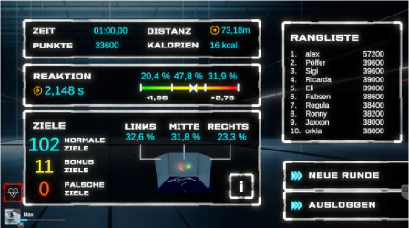
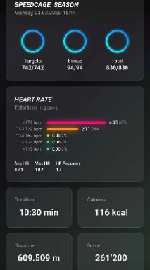
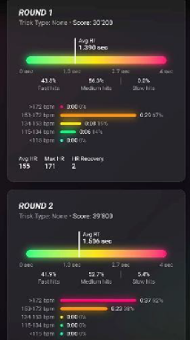
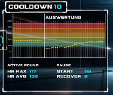
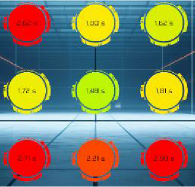
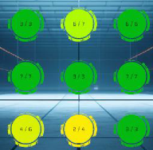
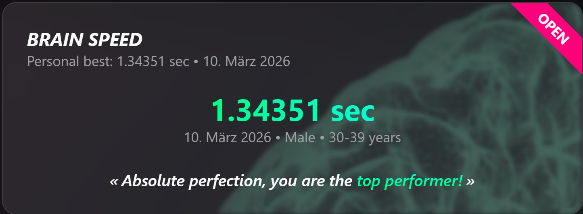
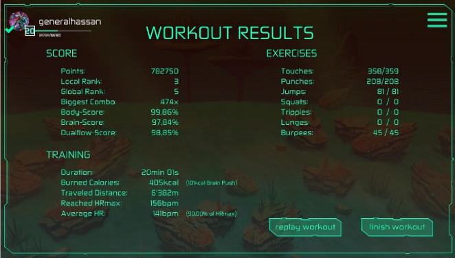
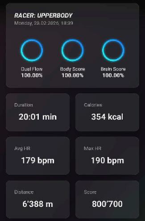

# [ExerCube] — Recorded Metrics, Including Descriptions

> Markdown conversion of `ExerCube Data.docx` (Sphery metrics documentation,
> received July 2026). Definitions below are Sphery's own wording.

## SpeedCage program

Performance metrics available for both the entire workout and individual laps.

*Tablet:*

{width=70%}

*App:*

{width=35%}
{width=35%}

- **Score:** Total points scored based on targets hit
- **Distance:** Distance covered in metres
- **Calories burned:** Number of calories burned
- **HR**
  - **HR Average:** Average heart rate
  - **HR-Max:** Maximum heart rate achieved
  - **HR-Recovery:** Difference between HR value at the start and end of a break
  - **HR-Zones:** Time spent in zones calculated for the individual
    (image of cube wall; above/in app for more detail)

{width=45%}

- **Reaction Time**
  - **RT-Average:** Average reaction time (time from appearance to hitting the target)
  - **RT Analysis:** Distribution of reaction times across thirds of the target display time (0–4 s)
- **Targets**
  - **Analysis:** Number of normal, bonus, and incorrect targets hit
  - **Distribution:** Analysis of targets touched per wall (totals 100% if all targets are hit)
- **Heat maps**
  - **Targets (hits):** Detailed analysis of correct targets hit per field (left image)
  - **Targets (reaction):** Detailed analysis of reaction times for correct targets hit per field (right image)

{width=35%}
{width=35%}

- **Brain Speed Assessment** *(available once a month)*
  Tracks improvements in reaction time using a standardized training protocol
  with challenging cognitive tasks and a fixed benchmark round for direct
  performance comparison.

{width=70%}

# Racer program

*Tablet:*

{width=85%}

*App:*

{width=40%}

- **Points:** Score achieved
- **Body Score:** Percentage of exercises performed correctly (%)
- **Brain Score:** Percentage of timings performed correctly (%)
- **Dual-Flow Score:** Combination of Body and Brain Scores (%)
- **Biggest Combo:** Highest number of exercises performed correctly in succession
- **Burned Calories:** Number of calories burned
- **HR-Max:** Maximum heart rate achieved
- **HR-Average:** Average heart rate
- **Distance:** Distance value converted to moderate jogging based on workout duration, number, and type of exercises

# Further information

## Assessment program *(no reporting currently available)*

- **Simple Reaction:** Reaction speed
- **N-Back:** Reaction, concentration & memory
- **Trail Making:** Cognitive flexibility, processing speed, attention, reaction and overview
