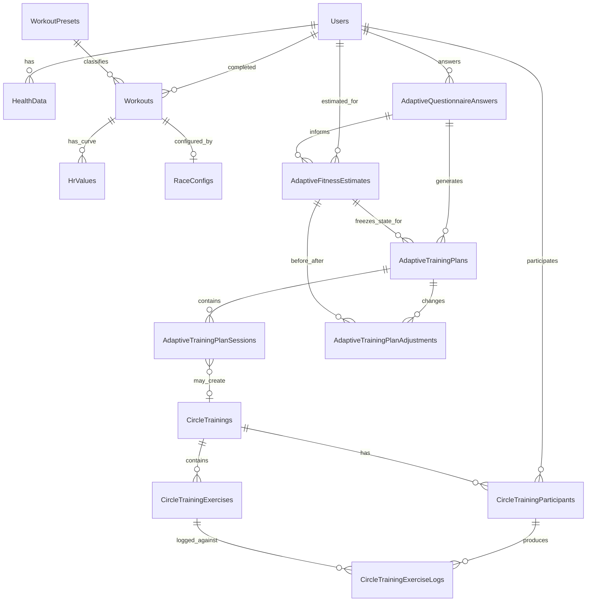
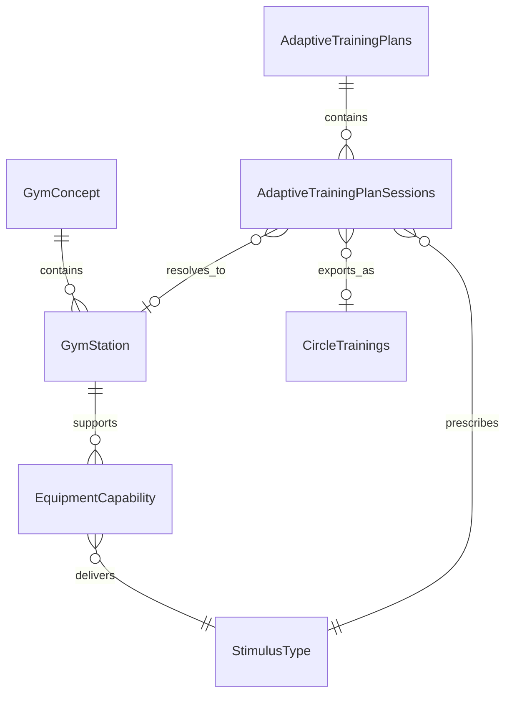

# Adaptive Training Schema Handoff For Michel

> **Superseded, July 21 2026. Do not send this to Michel.**
>
> The schema proposal in this document has been replaced. Current sources of
> truth, as of Aug 13 2026:
>
> - **`engine/db/schema.sql`** — the plan app's own database, PostgreSQL 16,
>   58 tables. Verified by `engine/db/verify_schema.sql`.
> - **`engine/db/seed_gyms.sql`** — the gym floors.
> - **`docs/plan-app-database-design.md`** — the reasoning behind the schema.
>
> The intermediate replacements this banner originally named
> (`sphery_additions.sql`, `sphery_seed.sql`, `docs/michel-what-to-add.md`)
> were themselves superseded on Aug 11, when Michel chose a separate store over
> adding tables to the Sphery database. The first two files no longer exist.
>
> What changed, and why:
>
> | This document | Current |
> |---|---|
> | 5 tables, `Adaptive*` prefix | 12 tables, `TrainingPlan*` prefix |
> | Recommends local shadow tables that do not touch production | Additions to Sphery's own database; there is no second store |
> | Open question: main DB or separate adaptive schema | Decided: one database, Sphery's |
> | `AdaptiveFitnessEstimates` as a table | A JSON snapshot on `TrainingPlans` |
> | `AdaptiveTrainingPlanSessions` normalized | Sessions live in `TrainingPlans.weeks` JSON |
> | Safety flags block automatic plan issue | Removed; injuries drive station exclusions instead |
> | `zone1DurationSeconds`…`zone5DurationSeconds`, `hrMin` | `timeInTier1-5`, matching what `Workouts` already uses |
> | `gymId` as a string | A real `Gyms` table with an integer foreign key |
> | No points, rewards, quests, session logs, or gym floor | All covered |
>
> **Still worth reading**, and better argued here than anywhere since:
> "Why The Current `target` Field Is Not Enough", "Why HR-Zone Tracking Is
> Vital", "Equipment-Agnostic Design", and "Product Boundaries". Those four
> sections are why the current asks exist.

**Audience:** Michel / backend  
**Purpose:** Explain what Anthony is building, what data is missing, and what schema/API additions would make the adaptive training plan work without duplicating the Sphery app or Nexus kiosk.

## One-Sentence Product Explanation

I am building the adaptive planning layer between the Sphery app and Nexus kiosk: the Sphery app knows who the member is, my layer decides what they should do next and why, and the Nexus kiosk runs the generated circle training.

## Product Positioning

This is not a standalone consumer fitness app. It is part of the Sphere gym concept and should be sold as a B2B2C retention feature.

- **Buyer:** franchise gym owner / operator.
- **End user:** gym member.
- **Sphery system:** Sphery app + Nexus kiosk + instrumented stations + backend.
- **Adaptive layer:** personalized plan, explanation, and adaptation.

The product promise to a gym owner:

> Every member gets a guided 4-week training plan that adapts as they train, which gives them a reason to come back and makes the Sphere concept feel personally coached.

The product promise to a member:

> You do not need to know what to do. The system tells you the next session, why it is right for you, and how it changes as you improve.

## Product Boundaries

The adaptive layer should not duplicate data or screens that already belong to the Sphery app or Nexus kiosk.

### Sphery App Owns

- Account/profile management.
- Membership.
- Booking and member home, unless the adaptive app needs a temporary demo handoff.
- Historical result dashboards already shown to members.

### Nexus Kiosk Owns

- Live training runtime.
- Station start/stop controls.
- Sensor pairing.
- Live leaderboard.
- Standard circle setup and team flow.

### Adaptive Layer Owns

- Questionnaire answers and intent.
- Fitness estimate snapshots.
- Generated 4-week plan.
- Planned sessions and their kiosk-ready output.
- Adaptation events and explanations.
- The next-session habit loop.

Rule of thumb: if the information answers "what should I do next and why?", it belongs in the adaptive layer. If it answers "what is happening live at the station?", it belongs in Nexus. If it answers "who am I as a Sphery member?", it belongs in the Sphery app.

## Why The Current `target` Field Is Not Enough

Current circle-training exercises have a field like:

```json
{
  "orderIndex": 1,
  "style": "repetitions",
  "name": "Leg Press",
  "target": "50x"
}
```

or:

```json
{
  "orderIndex": 2,
  "style": "duration",
  "name": "Ski Erg",
  "target": "8min"
}
```

That `target` is a **work target**. It tells the station what the member should complete: reps, time, score, distance, etc.

It does not tell the system:

- Intended HR zone.
- Intended stimulus: strength, recovery, cardio intensity, mobility, cognitive-motor, etc.
- Whether this session is supposed to be easy, moderate, or hard for this member.
- Whether a member stayed inside the intended intensity.
- Whether the next plan should progress, hold, or reduce load.

That is the gap.

For adaptive planning, two sessions can have the same visible station target but mean different things:

| Session | Station target | Intended stimulus | Intended HR zone | Meaning |
|---|---:|---|---:|---|
| Recovery | `8min` ExerCube | recovery | zone 1-2 | Keep moving, stay easy |
| Conditioning | `8min` ExerCube | cardio intensity | zone 4 | Push threshold/interval load |

The kiosk can run both with the same `target`, but the adaptive planner cannot later know which one was intended unless we store that separately.

## Why HR-Zone Tracking Is Vital

Current circle logs store:

- `measuredDuration`
- `score`
- `repetitions`
- `calories`
- `hrAverage`

This is useful, but not enough to know training stress.

Average HR hides intensity distribution. Example:

| Workout | Duration | Average HR | Zone distribution | Interpretation |
|---|---:|---:|---|---|
| A | 20 min | 140 bpm | 18 min zone 3, 2 min zone 4 | steady moderate work |
| B | 20 min | 140 bpm | 10 min zone 1, 10 min zone 5 | very hard intervals |

Same average. Very different physiological load.

For my app to adapt safely, it needs to know:

- How much time was spent in zones 1-2: recovery / low load.
- How much time was spent in zone 3: aerobic work.
- How much time was spent in zones 4-5: strenuous work.
- Whether the user overshot the intended zone.
- Whether they recovered better or worse over time.

The kiosk code already hints this was planned: participant, leaderboard, exercise log, stop exercise, stop training, and update exercise classes all expose HR-zone fields conceptually, but they are ignored in JSON today. The database tables also currently have only `hrAverage` for circle training logs and participants.

Suggested backend/API addition:

```sql
ALTER TABLE CircleTrainingExerciseLogs
  ADD COLUMN zone1DurationSeconds INT NULL,
  ADD COLUMN zone2DurationSeconds INT NULL,
  ADD COLUMN zone3DurationSeconds INT NULL,
  ADD COLUMN zone4DurationSeconds INT NULL,
  ADD COLUMN zone5DurationSeconds INT NULL,
  ADD COLUMN hrMax INT NULL,
  ADD COLUMN hrMin INT NULL;
```

Optional participant-level rollup:

```sql
ALTER TABLE CircleTrainingParticipants
  ADD COLUMN zone1DurationSeconds INT NULL,
  ADD COLUMN zone2DurationSeconds INT NULL,
  ADD COLUMN zone3DurationSeconds INT NULL,
  ADD COLUMN zone4DurationSeconds INT NULL,
  ADD COLUMN zone5DurationSeconds INT NULL,
  ADD COLUMN hrMax INT NULL,
  ADD COLUMN hrMin INT NULL;
```

The adaptive layer can work without this at first, but it will be less truthful. It would be adapting from duration, reps, score, and average HR instead of real physical strain.

## Equipment-Agnostic Design

The schema should not hard-code ExerCube, HYROX, XR Fighter, dumbbells, or treadmill into the plan logic.

The plan should be written in this order:

1. **Goal:** what the member wants.
2. **Stimulus:** what training effect the plan needs.
3. **Equipment resolution:** what this gym can use to deliver that stimulus.
4. **Kiosk payload:** the `CreateTrainingRequest` that Nexus can run.

Example:

| Goal | Stimulus needed | Sphere Darmstadt equipment | Hotel gym equipment |
|---|---|---|---|
| Build strength | strength + power | Leg Press, HYROX sled, free weights | dumbbells |
| Improve endurance | cardio endurance | ExerCube, bike, row erg | treadmill |
| Train body & mind | cognitive-motor + cardio | ExerCube, XR Fighter | treadmill intervals + reaction drill fallback |
| Move pain-free | mobility + recovery | ICAROS, mobility station | bodyweight mobility |

This is why `PlanSession` stores `stimulusType` and `stimulusMixJson` first, then stores the resolved equipment separately. The plan remains portable across gym concepts.

## ER Diagram: Current Tables Plus Adaptive Tables

This Mermaid diagram can be recreated on Miro.



## ER Diagram: Equipment-Agnostic Planning



If Michel does not want to add gym/equipment tables now, this can start as a versioned JSON config:

```json
{
  "gymId": "sphere_darmstadt",
  "stations": [
    { "id": "exercube", "name": "ExerCube", "stimuli": ["cardio_intensity", "cardio_endurance", "cognitive_motor"] },
    { "id": "leg_press", "name": "Leg Press", "stimuli": ["strength"] },
    { "id": "treadmill", "name": "Treadmill", "stimuli": ["cardio_endurance", "cardio_intensity"] }
  ]
}
```

## Proposed Adaptive Tables

The goal is five core tables, all additive. Names can change to match backend conventions.

### 1. `AdaptiveQuestionnaireAnswers`

Purpose: stores member intent and constraints missing from existing Sphery tables.

Design reason: the Sphery database knows what the member did. It does not know what they want, what days they can train, what other sports they do, or whether safety flags should block automatic plan issue.

Example source: onboarding questionnaire.

Example row:

```json
{
  "id": 12,
  "userId": 82,
  "goal": "build_strength_muscle",
  "focusJson": ["hypertrophy", "functional_strength"],
  "experienceLevel": "beginner",
  "activityLevel": "moderate",
  "sessionsPerWeek": 3,
  "sessionLengthMinutes": 45,
  "availableDaysJson": ["mon", "wed", "fri"],
  "currentTrainingMinutesPerWeek": 180,
  "currentIntensity": 3,
  "otherActivitiesJson": [
    { "name": "football", "minutesPerWeek": 90, "intensity": 4 }
  ],
  "gymId": "sphere_darmstadt",
  "hasMedicalFlags": false,
  "heightCmSnapshot": 180,
  "weightKgSnapshot": 78,
  "genderSnapshot": "male",
  "questionnaireVersion": "v1"
}
```

How fields are derived:

- `goal`: one required choice in the UI.
- `focusJson`: zero to two focus choices; required for safety/outcome-critical goals.
- `sessionsPerWeek`, `sessionLengthMinutes`, `availableDaysJson`: training setup section.
- `otherActivitiesJson`: manually entered external sports, used to avoid overload.
- `hasMedicalFlags`: true if injury, medical condition, high pain, or missing clearance is reported.
- snapshots: copied from questionnaire or `HealthData` at time of answer.

Truth and limitations:

- This table is self-reported. It is not a physiological measurement.
- It is still necessary because goals and availability cannot be inferred reliably from workout logs.

### 2. `AdaptiveFitnessEstimates`

Purpose: stores the engine's interpretation of current fitness at the moment a plan is generated or adapted.

Design reason: a plan should be auditable. If the next plan changes, we need to know what estimate caused the previous plan and what changed.

Example row:

```json
{
  "id": 31,
  "userId": 82,
  "questionnaireAnswerId": 12,
  "source": "session_history",
  "sourceWorkoutCount": 42,
  "sourceSpeedCageCount": 8,
  "sourceCircleTrainingCount": 3,
  "sourceStartDate": "2026-04-01",
  "sourceEndDate": "2026-07-20",
  "estimatedRestingHr": 61,
  "estimatedMaxHr": 188,
  "fitnessScore": 68,
  "recoveryScore": 72,
  "enduranceScore": 64,
  "performanceScore": 70,
  "cognitiveMotorScore": 59,
  "confidence": 0.78,
  "featuresJson": {
    "recentAvgHr": 146,
    "observedMaxHr": 184,
    "avgZone4To5Share": 0.34,
    "medianHrRecovery": 24,
    "completedWorkoutsLast30Days": 6
  },
  "modelVersion": "rules_v0.1"
}
```

How fields are derived:

- `estimatedRestingHr`: from lowest sustained HR values where available; cold start uses age/activity prior.
- `estimatedMaxHr`: observed max HR where available, with Tanaka formula fallback: `208 - 0.7 * age`.
- `fitnessScore`: composite score from consistency, completion, HR response, and performance trends.
- `recoveryScore`: HR recovery signal where available.
- `enduranceScore`: time in aerobic zones, completion volume, and sustained-duration performance.
- `performanceScore`: score/reps/distance relative to duration and difficulty.
- `cognitiveMotorScore`: SpeedCage reaction/brainSpeed or ExerCube brain/dual-flow signals where available.
- `confidence`: increases with usable history volume and HR coverage; lower for questionnaire-only estimates.
- `featuresJson`: stores raw derived inputs so the estimate can be explained later.

Truth and limitations:

- This is an estimate, not a clinical measure.
- It is useful if it moves in the correct direction as training improves.
- `bodyAge` and `brainAge`, if used, should be framed as motivational metrics, not medical claims.

### 3. `AdaptiveTrainingPlans`

Purpose: stores the current generated plan parent object.

Design reason: the app needs to know which plan is active, which estimate created it, and why it exists.

Example row:

```json
{
  "id": 44,
  "userId": 82,
  "questionnaireAnswerId": 12,
  "fitnessEstimateId": 31,
  "status": "active",
  "goal": "build_strength_muscle",
  "startDate": "2026-07-20",
  "endDate": "2026-08-16",
  "cycleWeeks": 4,
  "sessionsPerWeek": 3,
  "generatorVersion": "rules_v0.1",
  "configFormat": "CreateTrainingRequest",
  "rationale": "Strength-focused plan with conditioning support because the member chose hypertrophy and functional strength, has moderate current activity, and has enough HR history for medium confidence."
}
```

How fields are derived:

- `status`: generated by lifecycle logic.
- `goal`: copied from questionnaire for easy querying.
- `cycleWeeks`: default 4 because Sphere membership messaging already references 4-week plans.
- `rationale`: generated from goal, focus, estimate, and constraints.

Truth and limitations:

- The plan is a generated recommendation.
- It is explainable because it points back to one questionnaire answer and one fitness estimate.

### 4. `AdaptiveTrainingPlanSessions`

Purpose: stores each planned session in equipment-agnostic terms and preserves the kiosk-ready output.

Design reason: this is the bridge from "training plan" to "Nexus can run it."

Example row:

```json
{
  "id": 201,
  "planId": 44,
  "weekIndex": 1,
  "sessionIndex": 1,
  "primaryStimulusType": "strength",
  "stimulusMixJson": {
    "strength": 0.65,
    "cardio_intensity": 0.25,
    "mobility_stability": 0.1
  },
  "intensityZone": 3,
  "targetHrMin": 132,
  "targetHrMax": 148,
  "durationMinutes": 45,
  "difficulty": 5,
  "progressionRule": "increase load next week if all sessions completed and zone4-5 share stays below cap",
  "scheduledSlot": "freies_training",
  "resolvedEquipmentType": "sphere_circle",
  "resolvedModeKey": "darmstadt_strength_circle",
  "resolvedExerciseName": "Leg Press",
  "resolvedTarget": "50x",
  "circleTrainingId": null,
  "createdExerciseLogIdsJson": null,
  "status": "planned"
}
```

Example kiosk payload stored in `createTrainingRequestJson`:

```json
{
  "kioskId": "darmstadt-main",
  "setupByUserId": 82,
  "hyrox": false,
  "name": "My Plan - Strength W1S1",
  "mode": "single",
  "status": "setup",
  "style": "duration",
  "exercises": [
    { "orderIndex": 1, "style": "repetitions", "name": "Leg Press", "target": "50x" },
    { "orderIndex": 2, "style": "duration", "name": "ExerCube", "target": "8min" }
  ],
  "participants": [
    { "userId": 82, "category": "mixed", "division": "open", "teamName": null }
  ]
}
```

How fields are derived:

- `primaryStimulusType` and `stimulusMixJson`: from goal-to-stimulus rules.
- `intensityZone`, `targetHrMin`, `targetHrMax`: from fitness estimate and session stimulus.
- `difficulty`: from estimate, experience, current training load, and progression week.
- `resolvedEquipmentType`, `resolvedModeKey`, `resolvedExerciseName`, `resolvedTarget`: from gym equipment capability mapping.
- `createTrainingRequestJson`: serialization of the session into the existing kiosk contract.
- `circleTrainingId`: set only if/when the plan app actually creates a real circle training.
- `createdExerciseLogIdsJson`: set from `TrainingResponse` after `POST circle-trainings`.

Truth and limitations:

- The adaptive truth lives in stimulus and intensity fields.
- The kiosk truth lives in `CreateTrainingRequest`.
- Both are needed because current kiosk payload can run the session but cannot fully express why it was prescribed.

### 5. `AdaptiveTrainingPlanAdjustments`

Purpose: stores every meaningful plan change and the reason for it.

Design reason: adaptation without explanation will look random and will be hard to debug.

Example row:

```json
{
  "id": 77,
  "planId": 44,
  "previousPlanId": 44,
  "newPlanId": 45,
  "trigger": "logs",
  "triggerCircleTrainingParticipantId": 901,
  "previousFitnessEstimateId": 31,
  "newFitnessEstimateId": 38,
  "adjustmentType": "increase_load",
  "change": "Week 2 conditioning session increased from zone 3 to low zone 4.",
  "rationale": "The member completed all planned sessions, average HR stayed inside target, and HR recovery improved by 8 bpm.",
  "signalsJson": {
    "sessionsCompletedThisWeek": 3,
    "plannedSessionsThisWeek": 3,
    "hrRecoveryDelta": 8,
    "zone4To5Share": 0.22,
    "avgHrWithinTarget": true
  }
}
```

How fields are derived:

- `trigger`: the event that caused a re-check.
- `previousFitnessEstimateId` and `newFitnessEstimateId`: before/after snapshots.
- `adjustmentType`: generated by rules.
- `signalsJson`: concrete measurements that caused the rule to fire.
- `change` and `rationale`: user/backend-readable explanation.

Truth and limitations:

- This table does not claim the algorithm is perfect.
- It makes decisions inspectable and reversible.
- It is the audit trail for adaptive behavior.

## Minimal Schema Additions For HR-Zone Tracking

If Michel only has time for one backend improvement outside the adaptive tables, prioritize circle HR zones.

### Exercise log level

Add to `CircleTrainingExerciseLogs`:

- `hrMin`
- `hrMax`
- `zone1DurationSeconds`
- `zone2DurationSeconds`
- `zone3DurationSeconds`
- `zone4DurationSeconds`
- `zone5DurationSeconds`

### Participant rollup level

Add to `CircleTrainingParticipants`:

- `hrMin`
- `hrMax`
- `zone1DurationSeconds`
- `zone2DurationSeconds`
- `zone3DurationSeconds`
- `zone4DurationSeconds`
- `zone5DurationSeconds`

### API payload shape

Use the same names already used by `SpeedCages` / `SpeedCageRounds` where possible:

```json
{
  "hrAverage": 142,
  "hrMax": 176,
  "hrMin": 91,
  "zone1DurationSeconds": 120,
  "zone2DurationSeconds": 300,
  "zone3DurationSeconds": 780,
  "zone4DurationSeconds": 360,
  "zone5DurationSeconds": 30
}
```

Design reason: this aligns circle training logs with existing SpeedCage zone fields and gives the adaptive engine a consistent physical-load signal.

## Can Anthony Prototype Without Michel Changing Production?

Yes, but there are tradeoffs.

### Option A: Local Shadow Tables

Anthony creates the adaptive tables in the local MySQL export only.

Pros:

- Fast.
- Does not touch production.
- Lets the demo run end-to-end locally.
- Michel can review the actual DDL later.

Cons:

- Not production-integrated.
- Needs migration/reimplementation in backend repo later.

Best use: current internship demo.

### Option B: Sidecar Database Or Separate Schema

Run a separate adaptive database/schema that stores only the new adaptive tables and references `Users.id`.

Pros:

- Avoids modifying Sphery production tables.
- Can move faster.
- Keeps experimental data separate.

Cons:

- Production app still needs connection/configuration work.
- Cross-database joins and referential integrity are weaker.

Best use: if Michel cannot add tables before August 20 but the team wants a realistic demo.

### Option C: JSON Files For V1

Store questionnaire answers, plans, estimates, and adjustments as local JSON artifacts.

Pros:

- Fastest.
- No DB dependency.

Cons:

- Not credible as backend design.
- Harder to demonstrate real integration.
- No SQL relationships.

Best use: emergency fallback only.

### Option D: Full Backend Migration

Michel adds the adaptive tables and circle HR-zone fields to the real backend schema.

Pros:

- Correct long-term path.
- Enables real productization.

Cons:

- More work for Michel.
- Needs review, migrations, API updates, and probably kiosk serialization changes.

Best use: production path after the concept/schema is approved.

Recommendation: Anthony should build **Option A** now with clean SQL migrations in this repo, then give Michel the DDL and examples. That reduces Michel's burden from "design this with me from scratch" to "review and adapt this proposed migration."

## What Michel Needs To Decide

1. Are the five adaptive table boundaries correct?
2. Should adaptive data live in the main Sphery database or a separate adaptive schema/service?
3. Should `CreateTrainingRequest` be stored as JSON in plan sessions, or should generated sessions immediately create real `CircleTrainings`?
4. Who should be `setupByUserId` for a member's plan-generated solo training?
5. Can we add HR-zone durations to circle logs and participant rollups?
6. Should HR targets/stimulus be added to the circle-training contract, or only stored in adaptive plan tables?
7. Does he prefer flexible JSON columns for v1, or more normalized tables now?

## What Anthony Should Bring To Michel

- This writeup.
- One ER diagram screenshot or Miro recreation.
- One concrete example flow: "Build Strength & Muscle, hypertrophy + functional strength, 3x/week, Mon/Wed/Fri, 45 minutes."
- Draft SQL migrations. (Superseded: `engine/db/sphery_additions.sql`.)
- A short list of required API additions:
  - create/read questionnaire answer,
  - generate/read active plan,
  - store fitness estimate,
  - store adaptation event,
  - add HR-zone duration fields to circle logs when available.
